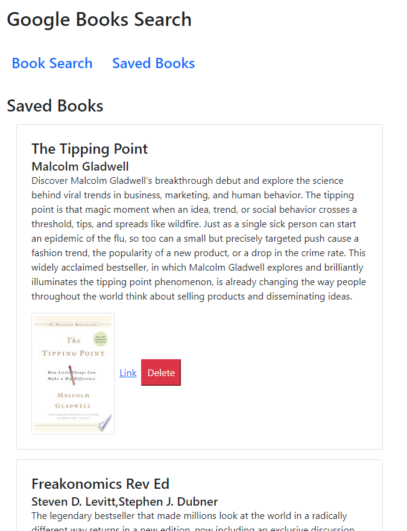

## Google Books Search
# Description
This application allows a user to search Google Books by book title, returning up to 10 results. The title, author, description, book cover, and link are displayed along with a button to save. Saved books are stored in a Mongo database. Once saved, books can also be deleted from this saved collection.

# Instructions
Enter text to search books by title and click 'Submit' to perform a search. After reviewing the results, choose the title you want to save by clicking the 'Save' button. Once saved, you can review your saved books by selecting 'Saved Books' from the navigation bar. If you would like to remove a book from your saved collection, click the 'Delete' button.

[Deployed App](https://young-hollows-25443.herokuapp.com/)

